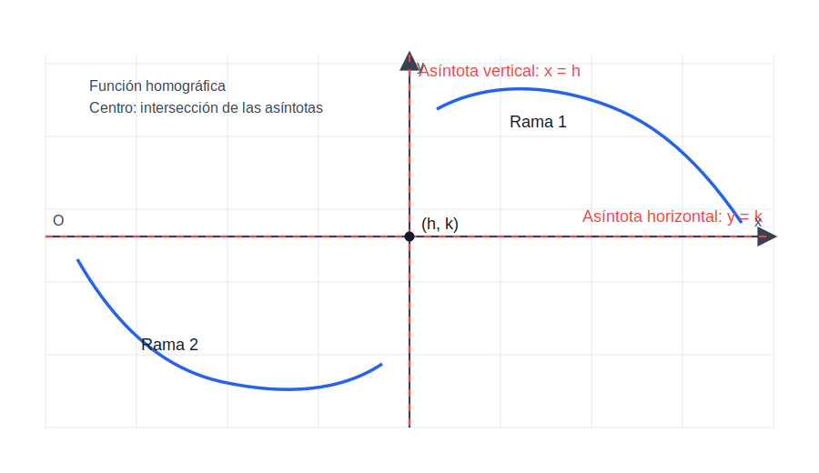
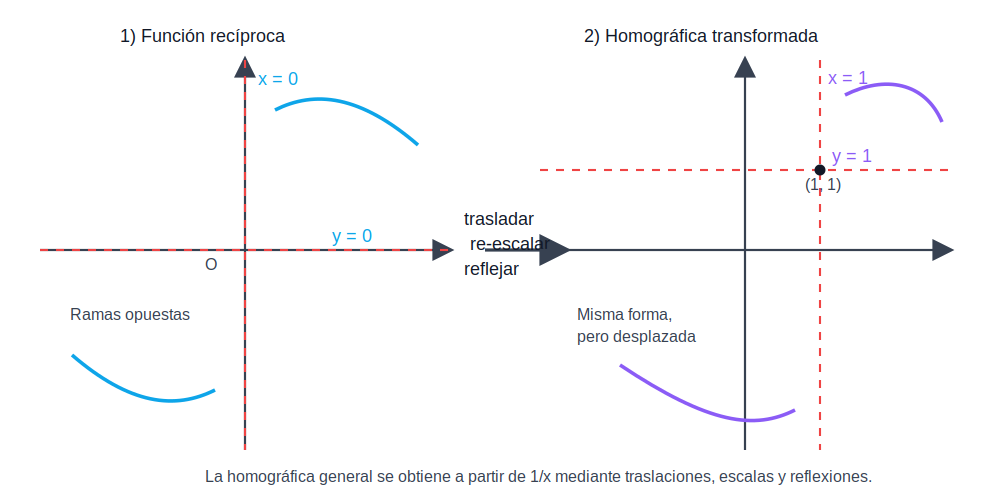

# Unidad 1 — Funciones

## 1. Definición de función

Una **función** $f$ de un conjunto $A$ en un conjunto $B$ es una regla que asigna a cada elemento $x \in A$ **uno y sólo un** elemento $y \in B$.

$$f : A \to B \,/\, y = f(x)$$

Se lee "$y$ es imagen de $x$ a través de $f$".

- **Dominio** $D_f = \text{Dom}\, f = A$: conjunto de todos los valores de entrada válidos.
- **Codominio** o **conjunto de llegada** $B$: conjunto donde "llegan" las imágenes.
- **Imagen** $I_f = \text{Im}\, f = \lbrace y \in B \,/\, \exists\, x \in A \text{ con } y = f(x) \rbrace$: subconjunto de $B$ formado por los valores efectivamente alcanzados.

### 1.1. La terna que define una función

Para describir completamente una función hace falta especificar **tres elementos**:

1. El **dominio** $A$.
2. El **codominio** $B$.
3. La **regla de asignación** $y = f(x)$.

A esa estructura se la llama **terna** que define la función y se escribe en el formato canónico:

$$f: A \to B \,/\, y = f(x)$$

Por ejemplo, $h:[0,4] \to [0,45]\,/\,y = h(t) = -5t^2 + 10t + 40$ es la terna completa para una función de tiro vertical.

### 1.2. Registros de representación

Una función puede presentarse en distintos **registros**:

| Registro | Descripción | Ejemplo |
|----------|-------------|---------|
| Analítico (algebraico) | Fórmula matemática | $f(x) = x^2 + 1$ |
| Tabular (numérico) | Tabla de pares $(x,\, f(x))$ | $\begin{array}{c\|c} x & f(x) \\ \hline 0 & 1 \\ 1 & 2 \end{array}$ |
| Gráfico | Curva en el plano cartesiano | dibujo de la curva |
| Verbal | Descripción en palabras | "el doble de $x$ más uno" |
{: .table-tight }

Las cuatro representaciones describen la misma función desde ángulos distintos. En la práctica, pasar de un registro a otro (de tabla a fórmula, de fórmula a gráfico) es una habilidad central de la materia.

---

## 2. Funciones como modelos matemáticos

Un **modelo matemático** es una descripción matemática de un fenómeno del mundo real (tamaño de una población, costo de un producto, velocidad de un objeto, etc.). Su finalidad es comprender el fenómeno y, eventualmente, predecir su comportamiento futuro.

### 2.1. Proceso de modelado

Para construir un modelo matemático típicamente se siguen estos pasos:

1. **Identificar las variables** involucradas. Distinguir:
   - **Variable independiente** (la que se "controla" o que varía libremente; por convención es la entrada $x$).
   - **Variable dependiente** (la que se calcula; la salida $y = f(x)$).
2. **Establecer suposiciones** que simplifiquen el tratamiento matemático.
3. **Plantear la regla de asignación** $y = f(x)$.
4. **Determinar el dominio en contexto**, restringiendo los valores físicamente posibles.
5. **Determinar la imagen en contexto**.
6. **Interpretar la respuesta matemática** en términos del problema original.

### 2.2. Dominio en contexto

El **dominio natural** (también llamado **dominio matemático**) de una función dada por una fórmula es el conjunto de números reales para los cuales la operación tiene sentido (ver sección 12).

El **dominio en contexto** es el subconjunto del dominio natural que tiene sentido para el problema concreto. Por ejemplo, para una función que modela la cantidad de agua $V(t) = 100 + 10t$ en un tanque que se llena durante 48 horas, el dominio natural sería todo $\mathbb{R}$, pero el dominio en contexto es $[0, 48]$.

---

## 3. Razón de cambio media

Dados dos valores $x_0$ y $x_1$ del dominio, la **razón de cambio media** de $f$ en el intervalo $[x_0, x_1]$ es el cociente entre el cambio en la salida y el cambio en la entrada:

$$\frac{\Delta y}{\Delta x} = \frac{f(x_1) - f(x_0)}{x_1 - x_0}$$

Indica cuánto cambia $y$ en promedio por cada unidad que cambia $x$ en ese intervalo. Tiene unidades de "$y$ por unidad de $x$" (por ejemplo, litros por hora, metros por segundo, miles de euros por año).

### 3.1. Cambio uniforme vs no uniforme

- Si $\dfrac{\Delta y}{\Delta x}$ es **constante** para cualquier intervalo, el cambio es **uniforme** y la función es **lineal**.
- Si la razón de cambio media **varía** según el intervalo, el cambio es **no uniforme**. Esto ocurre en funciones cuadráticas, exponenciales, etc.

### 3.2. Interpretación

La razón de cambio media corresponde a la **pendiente de la recta secante** que une los puntos $(x_0, f(x_0))$ y $(x_1, f(x_1))$ sobre la gráfica. En la Unidad 3 se generaliza este concepto al pasar de la pendiente de la secante (razón de cambio media) a la pendiente de la tangente (razón de cambio instantánea, o derivada).

---

## 4. Ceros, signo y características gráficas

Para una función $f: A \to B$:

- **Ceros (o raíces):** $C^0 = \lbrace x \in A \,/\, f(x) = 0\rbrace$. Son los valores donde la gráfica corta al eje $x$.
- **Intervalo de positividad:** $I^+ = C^+ = \lbrace x \in A \,/\, f(x) > 0\rbrace$. Donde la gráfica queda **por arriba** del eje $x$.
- **Intervalo de negatividad:** $I^- = C^- = \lbrace x \in A \,/\, f(x) < 0\rbrace$. Donde la gráfica queda **por debajo** del eje $x$.
- **Intersección con el eje $y$:** el punto $(0, f(0))$, si $0 \in A$.

**Propiedad fundamental:** estos tres conjuntos cubren todo el dominio sin solapamiento:

$$C^0 \cup I^+ \cup I^- = A$$

**Método para hallarlos:** primero buscar los ceros (resolviendo $f(x) = 0$), luego analizar el signo de $f$ en cada intervalo que queda entre ceros consecutivos.

---

## 5. Clasificación por simetría: funciones par e impar

| Tipo | Condición | Simetría gráfica |
|------|-----------|-----------------|
| **Par** | $f(-x) = f(x)$ para todo $x \in D_f$ | Respecto al eje $y$ |
| **Impar** | $f(-x) = -f(x)$ para todo $x \in D_f$ | Respecto al origen |
| **Ninguna** | no cumple ninguna de las dos | sin simetría especial |
{: .table-tight }

**Observación.** El dominio debe ser **simétrico respecto al origen** para que la clasificación tenga sentido (si $x \in D_f$, también $-x \in D_f$).

### 5.1. Método analítico para clasificar

1. Calcular $f(-x)$ reemplazando $x$ por $-x$ en la regla.
2. Comparar con $f(x)$ y con $-f(x)$:
   - Si $f(-x) = f(x)$ para todo $x$ del dominio → **par**.
   - Si $f(-x) = -f(x)$ para todo $x$ del dominio → **impar**.
   - Si no se cumple ninguna de las dos → **ninguna**.

Para mostrar que una función **no tiene paridad**, basta dar un **contraejemplo**: un valor $x_0$ tal que $f(-x_0) \neq f(x_0)$ y $f(-x_0) \neq -f(x_0)$.

### 5.2. Ejemplos paradigmáticos

- **Pares:** $f(x) = x^2$, $g(x) = \lvert x \rvert$, $h(x) = \cos x$.
- **Impares:** $f(x) = x^3$, $g(x) = x$, $h(x) = \sin x$, $k(x) = \tan x$.

---

## 6. Funciones algebraicas

Son las que se obtienen aplicando un número finito de operaciones algebraicas (suma, resta, producto, cociente, potencias y raíces) a la variable $x$.

### 6.1. Funciones polinómicas

$$f(x) = a_n x^n + a_{n-1} x^{n-1} + \cdots + a_1 x + a_0$$

donde los $a_i \in \mathbb{R}$ son los coeficientes y $a_n \neq 0$ define el **grado** $n$ del polinomio.

- **Dominio:** $\mathbb{R}$ (todo polinomio está definido para cualquier real).
- Son continuas en todo $\mathbb{R}$ y no tienen asíntotas.

#### 6.1.1. Función constante

Caso $n = 0$: $f(x) = b$. Gráfica: recta horizontal a altura $b$. No tiene ceros (salvo $b=0$, en cuyo caso $f \equiv 0$).

#### 6.1.2. Función lineal

Caso $n = 1$: $f(x) = mx + b$, con $m \neq 0$. Su gráfica es una **recta no horizontal**.

- **Pendiente** $m$: variación de $y$ por cada unidad de $x$. Coincide con la razón de cambio media (que es constante en una recta).
- **Ordenada al origen** $b$: valor de la intersección con el eje $y$, es decir, $f(0) = b$.
- **Raíz:** $x = -\dfrac{b}{m}$, intersección con el eje $x$.

**Ángulo de inclinación.** Si $\alpha$ es el ángulo que forma la recta con la dirección positiva del eje $x$:

$$m = \tan(\alpha)$$

Por eso $m > 0$ corresponde a recta creciente y $m < 0$ a recta decreciente.

**Formas de representar una recta**

| Forma | Expresión | Cuándo usarla |
|-------|-----------|---------------|
| Explícita | $y = mx + b$ | Se conocen pendiente y ordenada al origen |
| Implícita (general) | $Ax + By + C = 0$ | Forma estándar; incluye rectas verticales ($B = 0$) |
| Punto-pendiente | $y - y_0 = m(x - x_0)$ | Se conocen pendiente $m$ y un punto $(x_0, y_0)$ |
| Segmentaria | $\dfrac{x}{p} + \dfrac{y}{q} = 1$ | Se conocen las intersecciones $(p, 0)$ y $(0, q)$ con los ejes |
| Que pasa por dos puntos | $y - y_1 = \dfrac{y_2 - y_1}{x_2 - x_1}(x - x_1)$ | Se conocen dos puntos $(x_1, y_1)$ y $(x_2, y_2)$ |
| Paramétrica | $x = x_0 + at,\ \ y = y_0 + bt$ | Descripción vectorial con parámetro $t \in \mathbb{R}$ |
{: .table-tight }

**Cálculo de la pendiente** dados dos puntos:

$$m = \frac{y_2 - y_1}{x_2 - x_1}$$

**Posiciones relativas de dos rectas** $y = m_1 x + b_1$ y $y = m_2 x + b_2$:

- **Paralelas:** $m_1 = m_2$ y $b_1 \neq b_2$.
- **Coincidentes:** $m_1 = m_2$ y $b_1 = b_2$.
- **Perpendiculares:** $m_1 \cdot m_2 = -1$.
- **Secantes (oblicuas):** $m_1 \neq m_2$.

#### 6.1.3. Función cuadrática

Caso $n = 2$: $f(x) = ax^2 + bx + c$, con $a \neq 0$. Su gráfica es una **parábola** con eje de simetría vertical.

- Si $a > 0$: parábola con ramas hacia arriba (mínimo en el vértice).
- Si $a < 0$: parábola con ramas hacia abajo (máximo en el vértice).
- **Discriminante** $\Delta = b^2 - 4ac$ determina la cantidad de raíces reales:

| $\Delta$ | Raíces reales |
|----------|---------------|
| $\Delta > 0$ | Dos raíces distintas |
| $\Delta = 0$ | Una raíz doble |
| $\Delta < 0$ | Ninguna raíz real |
{: .table-tight }

**Formas de representar una parábola**

| Forma | Expresión | Información directa |
|-------|-----------|---------------------|
| Polinómica (desarrollada) | $f(x) = ax^2 + bx + c$ | Ordenada al origen $c$ |
| Canónica (vértice) | $f(x) = a(x - h)^2 + k$ | Vértice $V = (h, k)$ y eje de simetría $x = h$ |
| Factorizada | $f(x) = a(x - x_1)(x - x_2)$ | Raíces $x_1$ y $x_2$ |
{: .table-tight }

**Vértice de la parábola** a partir de la forma polinómica:

$$h = -\frac{b}{2a}, \qquad k = f(h) = c - \frac{b^2}{4a}$$

**Raíces (fórmula resolvente):**

$$x_{1,2} = \frac{-b \pm \sqrt{b^2 - 4ac}}{2a}$$

**Relaciones de Vieta** entre coeficientes y raíces:

$$x_1 + x_2 = -\frac{b}{a}, \qquad x_1 \cdot x_2 = \frac{c}{a}$$

**Pasaje entre formas:** desarrollar la canónica o factorizada lleva a la polinómica; completar cuadrados lleva de polinómica a canónica; aplicar la resolvente y factorizar lleva de polinómica a factorizada (solo si $\Delta \geq 0$).

#### 6.1.4. Función cúbica

Caso $n = 3$: $f(x) = ax^3 + bx^2 + cx + d$, con $a \neq 0$. La más sencilla es $f(x) = x^3$.

Para $f(x) = x^3$:

- **Dominio e imagen:** $\mathbb{R}$.
- $C^0 = \lbrace 0\rbrace$, $I^+ = (0, +\infty)$, $I^- = (-\infty, 0)$.
- Es **impar** (simétrica respecto al origen).
- Estrictamente creciente en todo $\mathbb{R}$.

### 6.2. Funciones racionales

Son cocientes de polinomios:

$$f(x) = \frac{P(x)}{Q(x)}$$

con $P$ y $Q$ polinomios. El dominio natural es:

$$D_f = \mathbb{R} \setminus \lbrace x \,/\, Q(x) = 0\rbrace$$

#### 6.2.1. Función recíproco

El caso más sencillo es $f(x) = \dfrac{1}{x}$:

$$f: \mathbb{R} - \lbrace 0\rbrace \to \mathbb{R} - \lbrace 0\rbrace \,/\, f(x) = \frac{1}{x}$$

- **Dominio e imagen:** $\mathbb{R} - \lbrace 0\rbrace$.
- $I^+ = (0, +\infty)$, $I^- = (-\infty, 0)$.
- **Asíntota vertical:** $x = 0$ (eje $y$).
- **Asíntota horizontal:** $y = 0$ (eje $x$).
- Es **impar**: $f(-x) = -f(x)$.
- No tiene ceros.

#### 6.2.2. Función homográfica

Generalizando, una **función homográfica** tiene la forma:

$$f(x) = \frac{ax + b}{cx + d}, \quad c \neq 0,\ ad - bc \neq 0$$

La condición $c \neq 0$ asegura que el denominador sea realmente lineal, y la condición $ad - bc \neq 0$ evita que la expresión se reduzca a una constante al simplificar.

Para entenderla mejor, conviene reescribirla así:

$$f(x) = \frac{a}{c} + \frac{bc - ad}{c^2}\cdot \frac{1}{x + \frac{d}{c}}$$

Esta forma muestra algo importante:

- parte de la gráfica de $\dfrac{1}{x}$
- luego se traslada horizontalmente
- se traslada verticalmente
- y, según el signo de $\dfrac{bc-ad}{c^2}$, puede reflejarse respecto de los ejes

- **Dominio:** $\mathbb{R} - \lbrace -\dfrac{d}{c}\rbrace$.
- **Asíntota vertical:** $x = -\dfrac{d}{c}$ (raíz del denominador).
- **Asíntota horizontal:** $y = \dfrac{a}{c}$ (cociente de coeficientes principales).
- **Imagen:** $\mathbb{R} - \lbrace \dfrac{a}{c}\rbrace$.
- **Raíz (cero):** $x = -\dfrac{b}{a}$, si $a \neq 0$.

La gráfica es una **hipérbola** equilátera con centro en la intersección de las asíntotas:

$$\left(-\frac{d}{c},\; \frac{a}{c}\right)$$

Eso significa que el punto “central” de la curva no está en el origen, sino desplazado.

**Cómo leerla rápido:**

1. Buscar el denominador y hallar dónde se anula: eso da la asíntota vertical.
2. Comparar los coeficientes principales: eso da la asíntota horizontal.
3. Ubicar el centro como cruce de ambas asíntotas.
4. Ver si la curva queda como la de $\dfrac{1}{x}$ o reflejada.

{: .img-center}

{: .img-center}

**Idea principal:** una función homográfica no es una función “nueva” desde cero; es una versión desplazada y reescalada de la función recíproca $\dfrac{1}{x}$.

### 6.3. Funciones irracionales (con raíces)

$$f(x) = \sqrt[n]{g(x)}$$

- Para $n$ **par**: dominio condicionado por $g(x) \geq 0$.
- Para $n$ **impar**: dominio $= D_g$ (la raíz impar está definida para todo real).

#### 6.3.1. Función raíz cuadrada

Caso particular $f(x) = \sqrt{x}$:

$$f: [0, +\infty) \to [0, +\infty) \,/\, f(x) = \sqrt{x}$$

- **Dominio:** $[0, +\infty)$.
- **Imagen:** $[0, +\infty)$.
- $I^+ = (0, +\infty)$, no tiene $I^-$ (la raíz principal es no negativa).
- Único cero: $x = 0$.
- Estrictamente creciente.
- Su gráfica empieza en el origen y crece cada vez más lentamente.

---

## 7. Otras funciones importantes (no algebraicas o por casos)

### 7.1. Función valor absoluto (módulo)

$$f(x) = \lvert x \rvert = \begin{cases} x & \text{si } x \geq 0 \\ -x & \text{si } x < 0 \end{cases}$$

- **Dominio:** $\mathbb{R}$.
- **Imagen:** $[0, +\infty)$.
- $C^0 = \lbrace 0\rbrace$, $I^+ = \mathbb{R} - \lbrace 0\rbrace$, no tiene $I^-$.
- Es **par**: $\lvert -x\rvert = \lvert x\rvert$.
- Su gráfica tiene forma de "V" con vértice en el origen.

**Propiedades útiles:**

- $\lvert x \rvert \geq 0$ siempre, y $\lvert x\rvert = 0 \iff x = 0$.
- $\lvert x \cdot y \rvert = \lvert x\rvert \cdot \lvert y\rvert$.
- $\lvert x + y\rvert \leq \lvert x\rvert + \lvert y\rvert$ (desigualdad triangular).
- Para $a > 0$: $\lvert x\rvert < a \iff -a < x < a$ y $\lvert x\rvert > a \iff x < -a \text{ o } x > a$.

### 7.2. Funciones definidas por trozos (o por partes)

Una función está **definida por trozos** cuando su regla de asignación no es la misma para todos los valores del dominio, sino que cambia según el intervalo donde caiga $x$. Forma general:

$$f(x) = \begin{cases} f_1(x) & \text{si } x \in I_1 \\ f_2(x) & \text{si } x \in I_2 \\ \vdots \\ f_n(x) & \text{si } x \in I_n \end{cases}$$

con $I_1, I_2, \ldots, I_n$ intervalos disjuntos cuya unión es el dominio.

**Cómo trabajar con ellas:**

- **Dominio:** la unión de los intervalos $I_k$.
- **Imagen:** unión de las imágenes que aporta cada tramo, calculando cada $f_k$ sobre su intervalo correspondiente.
- **Ceros:** resolver $f_k(x) = 0$ **dentro** del intervalo $I_k$ correspondiente y verificar que la solución pertenezca a $I_k$.
- **Continuidad:** comparar los valores en los bordes (extremo derecho de un tramo con extremo izquierdo del siguiente). Tema profundizado en la Unidad 2.

**Casos especiales:**

- El valor absoluto $\lvert x\rvert$ es ya una función definida por trozos.
- La función parte entera (no es prioritaria en esta materia).

---

## 8. Funciones trascendentes

Son las que **no** son algebraicas. Las principales son las exponenciales, logarítmicas y trigonométricas.

### 8.1. Función exponencial

$$f(x) = a^x, \quad a > 0,\ a \neq 1$$

- **Dominio:** $\mathbb{R}$.
- **Imagen:** $(0, +\infty)$.
- **Intersección con el eje $y$:** $(0, 1)$ (porque $a^0 = 1$).
- **No corta al eje $x$.**
- **Asíntota horizontal:** $y = 0$.
- **No tiene paridad definida.**

**Comportamiento según la base:**

| Base | Comportamiento |
|------|----------------|
| $a > 1$ | **Creciente**: a más $x$, más $y$. Modela crecimiento exponencial. |
| $0 < a < 1$ | **Decreciente**: a más $x$, menos $y$. Modela decaimiento. |
{: .table-tight }

**Caso particular:** $f(x) = e^x$, donde $e \approx 2{,}71828$ es el número de Euler.

**Propiedades algebraicas:**

$$a^{x+y} = a^x \cdot a^y, \qquad a^{x-y} = \frac{a^x}{a^y}, \qquad (a^x)^y = a^{xy}, \qquad a^0 = 1$$

### 8.2. Función logarítmica

$$f(x) = \log_a(x), \quad a > 0,\ a \neq 1$$

Es la **función inversa** de la exponencial:

$$y = \log_a(x) \iff a^y = x$$

- **Dominio:** $(0, +\infty)$ (el argumento debe ser positivo).
- **Imagen:** $\mathbb{R}$.
- **Intersección con el eje $x$:** $(1, 0)$ (porque $\log_a(1) = 0$).
- **No corta al eje $y$.**
- **Asíntota vertical:** $x = 0$.
- **No tiene paridad definida.**

**Comportamiento según la base:**

| Base | Comportamiento |
|------|----------------|
| $a > 1$ | **Creciente** |
| $0 < a < 1$ | **Decreciente** |
{: .table-tight }

**Casos particulares:**

- $\ln x = \log_e x$ — logaritmo natural (base $e$).
- $\log x = \log_{10} x$ — logaritmo decimal (base 10), aunque la convención varía.

**Propiedades algebraicas (con $a, x, y > 0$ y $a \neq 1$):**

$$\log_a(x \cdot y) = \log_a x + \log_a y$$

$$\log_a\!\left(\frac{x}{y}\right) = \log_a x - \log_a y$$

$$\log_a(x^n) = n \log_a x$$

$$\log_a(a^x) = x, \qquad a^{\log_a x} = x$$

**Cambio de base:**

$$\log_a x = \frac{\log_b x}{\log_b a}$$

### 8.3. Funciones trigonométricas

| Función | Dominio | Imagen |
|---------|---------|--------|
| $\sin(x)$ | $\mathbb{R}$ | $[-1,\, 1]$ |
| $\cos(x)$ | $\mathbb{R}$ | $[-1,\, 1]$ |
| $\tan(x)$ | $\mathbb{R} \setminus \lbrace (2k+1)\dfrac{\pi}{2}\rbrace$ | $\mathbb{R}$ |
| $\cot(x)$ | $\mathbb{R} \setminus \lbrace k\pi\rbrace$ | $\mathbb{R}$ |
| $\sec(x)$ | $\mathbb{R} \setminus \lbrace (2k+1)\dfrac{\pi}{2}\rbrace$ | $(-\infty,-1] \cup [1,+\infty)$ |
| $\csc(x)$ | $\mathbb{R} \setminus \lbrace k\pi\rbrace$ | $(-\infty,-1] \cup [1,+\infty)$ |
{: .table-tight }

**Propiedades clave:**

- $\sin$ y $\cos$ son **acotadas**: $\lvert \sin x\rvert \leq 1$ y $\lvert\cos x\rvert \leq 1$.
- $\sin$, $\tan$ y $\cot$ son **impares**; $\cos$ y $\sec$ son **pares**.
- Son **periódicas**: $\sin$, $\cos$, $\sec$, $\csc$ tienen período $2\pi$; $\tan$ y $\cot$ tienen período $\pi$.

**Ceros:**

- $\sin x = 0 \iff x = k\pi$ con $k \in \mathbb{Z}$.
- $\cos x = 0 \iff x = (2k+1)\dfrac{\pi}{2}$ con $k \in \mathbb{Z}$.
- $\tan x = 0 \iff x = k\pi$ con $k \in \mathbb{Z}$.

#### Identidades importantes

$$\tan x = \frac{\sin x}{\cos x}, \qquad \cot x = \frac{\cos x}{\sin x}, \qquad \sec x = \frac{1}{\cos x}, \qquad \csc x = \frac{1}{\sin x}$$

**Pitagóricas:**

$$\sin^2 x + \cos^2 x = 1$$

$$\tan^2 x + 1 = \sec^2 x$$

$$\cot^2 x + 1 = \csc^2 x$$

### 8.4. Funciones trigonométricas inversas

Por convención, se restringen los dominios de las trigonométricas para que sean biyectivas y admitan inversa:

| Función | Dominio | Imagen |
|---------|---------|--------|
| $\arcsin(x)$ | $[-1,\, 1]$ | $\left[-\dfrac{\pi}{2},\, \dfrac{\pi}{2}\right]$ |
| $\arccos(x)$ | $[-1,\, 1]$ | $[0,\, \pi]$ |
| $\arctan(x)$ | $\mathbb{R}$ | $\left(-\dfrac{\pi}{2},\, \dfrac{\pi}{2}\right)$ |
{: .table-tight }

Dado un número $y$, $\arcsin(y)$ devuelve **el único** ángulo $x$ en el intervalo restringido tal que $\sin x = y$.

---

## 9. Funciones periódicas y acotadas

### 9.1. Función periódica

Una función $f$ es **periódica** de período $P > 0$ si

$$f(x + P) = f(x) \qquad \forall x \in D_f$$

El menor $P > 0$ que cumple la condición se llama **período fundamental**. La gráfica se repite cada $P$ unidades sobre el eje $x$.

La **frecuencia** $\dfrac{1}{P}$ indica cuántos ciclos completos ocurren por unidad de variable independiente.

**Para $y = A \sin(B x)$ o $y = A \cos(Bx)$:**

- **Amplitud:** $\lvert A\rvert$ — la imagen es $[-\lvert A\rvert, \lvert A\rvert]$.
- **Período:** $P = \dfrac{2\pi}{\lvert B\rvert}$.

### 9.2. Función acotada

Una función $f$ está:

- **Acotada superiormente** si existe $M \in \mathbb{R}$ tal que $f(x) \leq M$ para todo $x \in D_f$.
- **Acotada inferiormente** si existe $m \in \mathbb{R}$ tal que $f(x) \geq m$ para todo $x \in D_f$.
- **Acotada** si está acotada superior e inferiormente, es decir, existe $k > 0$ tal que $\lvert f(x)\rvert \leq k$ para todo $x \in D_f$.

Las funciones $\sin x$ y $\cos x$ son acotadas (por $k = 1$). $\arctan x$ está acotada por $\pi/2$. En cambio, los polinomios no constantes, las exponenciales y las logarítmicas **no** son acotadas.

---

## 10. Igualdad de funciones

Dos funciones $f: A \to B$ y $g: C \to D$ son **iguales** si y solo si:

1. $A = C$ (mismo dominio).
2. $B = D$ (mismo codominio).
3. $f(x) = g(x)$ para todo $x$ del dominio.

Es decir, dos funciones pueden tener la misma fórmula y aun así **no ser iguales** si sus dominios o codominios difieren.

**Ejemplo típico.** $f(x) = \dfrac{x^2 - 16}{x + 4}$ y $g(x) = x - 4$ no son iguales:

- $D_f = \mathbb{R} - \lbrace -4\rbrace$ (el denominador se anula en $-4$).
- $D_g = \mathbb{R}$.

Aunque para todo $x \neq -4$ vale $\dfrac{x^2-16}{x+4} = x - 4$, los dominios son distintos. Para que $f$ y $g$ sean iguales habría que redefinir alguna de las dos para que coincidan los dominios.

---

## 11. Álgebra de funciones

Dadas $f: A \to B$ y $g: C \to D$ (con $A \cap C \neq \varnothing$):

| Operación | Definición | Dominio |
|-----------|------------|---------|
| Suma | $(f + g)(x) = f(x) + g(x)$ | $D_f \cap D_g$ |
| Resta | $(f - g)(x) = f(x) - g(x)$ | $D_f \cap D_g$ |
| Producto | $(f \cdot g)(x) = f(x) \cdot g(x)$ | $D_f \cap D_g$ |
| Cociente | $\left(\dfrac{f}{g}\right)(x) = \dfrac{f(x)}{g(x)}$ | $D_f \cap D_g - \lbrace x \,/\, g(x) = 0\rbrace$ |
| Producto por escalar | $(k\,f)(x) = k\,f(x)$ | $D_f$ |
| Composición | $(f \circ g)(x) = f(g(x))$ | $\lbrace x \in D_g \,/\, g(x) \in D_f\rbrace$ |
{: .table-tight }

### 11.1. Composición de funciones

La composición $f \circ g$ aplica primero $g$ y después $f$. Es importante notar que:

- En general, **$f \circ g \neq g \circ f$** (la composición no es conmutativa).
- El dominio de $f \circ g$ son los $x$ donde **primero** $g(x)$ exista, **y además** $g(x)$ caiga dentro del dominio de $f$.

---

## 12. Dominio natural — cálculo

Cuando solo se da la regla de asignación (sin especificar dominio), llamamos **dominio natural** al conjunto de números reales para los que la operación tiene sentido. Las restricciones más comunes son:

| Operación | Restricción |
|-----------|-------------|
| División | El denominador no puede ser $0$. |
| Raíz de índice par | El radicando debe ser $\geq 0$ (y $> 0$ si va en denominador). |
| Logaritmo | El argumento debe ser $> 0$. |
| Tangente / Secante | $\cos x \neq 0$, es decir $x \neq (2k+1)\dfrac{\pi}{2}$. |
| Cotangente / Cosecante | $\sin x \neq 0$, es decir $x \neq k\pi$. |
| Funciones inversas trig. (arcsen, arccos) | Argumento en $[-1, 1]$. |
{: .table-tight }

**Estrategia general:** intersecar todas las condiciones que impone cada parte de la expresión. Para cocientes, raíces e inversas, plantear inecuaciones y resolverlas (a menudo con cuadro de signos).

**Para funciones definidas por trozos:** analizar el dominio admisible de **cada tramo por separado** y luego unir.

---

## 13. Transformaciones de funciones

A partir de $y = f(x)$, modificaciones simples a la regla producen efectos geométricos predecibles. Sea $c \in \mathbb{R}$:

| Transformación | Fórmula | Efecto |
|----------------|---------|--------|
| Desplazamiento vertical | $y = f(x) + c$ | ↑ si $c > 0$, ↓ si $c < 0$ |
| Desplazamiento horizontal | $y = f(x - c)$ | → si $c > 0$, ← si $c < 0$ |
| Reflexión respecto al eje $x$ | $y = -f(x)$ | "voltea" verticalmente |
| Reflexión respecto al eje $y$ | $y = f(-x)$ | "voltea" horizontalmente |
| Estiramiento / compresión vertical | $y = c \cdot f(x)$ | estira si $\lvert c\rvert > 1$, comprime si $0 < \lvert c\rvert < 1$ |
| Estiramiento / compresión horizontal | $y = f(c \cdot x)$ | comprime si $\lvert c\rvert > 1$, estira si $0 < \lvert c\rvert < 1$ |
{: .table-tight }

**Reglas prácticas:**

- Las transformaciones del **lado de afuera** de $f$ (sobre $y$) afectan el **eje vertical** y son intuitivas (suma → sube, multiplica → estira).
- Las transformaciones del **lado de adentro** (sobre $x$) afectan el **eje horizontal** y son "al revés" de lo intuitivo (sumar dentro mueve a la izquierda, multiplicar dentro comprime).

---

## 14. Funciones inyectivas, sobreyectivas y biyectivas

### 14.1. Inyectividad

$f: A \to B$ es **inyectiva** (o uno-a-uno) si elementos distintos del dominio tienen imágenes distintas:

$$x_1 \neq x_2 \implies f(x_1) \neq f(x_2) \qquad \forall x_1, x_2 \in A$$

Equivalentemente (contrarrecíproco, más útil en la práctica):

$$f(x_1) = f(x_2) \implies x_1 = x_2 \qquad \forall x_1, x_2 \in A$$

**Test gráfico (recta horizontal):** $f$ es inyectiva si y solo si toda recta horizontal corta al gráfico en **a lo sumo** un punto.

**Método analítico:** suponer $f(x_1) = f(x_2)$ y deducir $x_1 = x_2$. Por ejemplo, para $f(x) = mx + b$ con $m \neq 0$:

$$mx_1 + b = mx_2 + b \implies mx_1 = mx_2 \implies x_1 = x_2$$

Por lo tanto $f$ es inyectiva.

### 14.2. Sobreyectividad

$f: A \to B$ es **sobreyectiva** (o suryectiva, o "sobre") si **todo** elemento del codominio es imagen de al menos un elemento del dominio:

$$\text{Im}\,f = B$$

Equivalentemente: $\forall y \in B,\ \exists x \in A$ tal que $y = f(x)$.

### 14.3. Biyectividad

$f$ es **biyectiva** si es inyectiva **y** sobreyectiva. Esta es la condición necesaria y suficiente para que exista la **función inversa**.

**Cómo "forzar" la biyectividad.** Si una función no es inyectiva, se puede **restringir su dominio** a un intervalo donde sí lo sea. Si no es sobreyectiva, se puede **redefinir el codominio** igualándolo a la imagen. Estas dos acciones son las que se usan, por ejemplo, para definir $\arcsin$, $\arccos$ y $\arctan$ a partir de las trigonométricas.

---

## 15. Función inversa

Si $f: A \to B$ es **biyectiva**, existe una única función

$$f^{-1}: B \to A$$

llamada **función inversa** de $f$, definida por:

$$y = f(x) \iff x = f^{-1}(y)$$

Cumple:

$$f^{-1}(f(x)) = x \quad \forall x \in A, \qquad f(f^{-1}(y)) = y \quad \forall y \in B$$

### 15.1. Procedimiento para calcular $f^{-1}$

1. **Verificar que $f$ sea biyectiva.** Si no lo es, redefinir el dominio (para inyectividad) y/o el codominio (para sobreyectividad).
2. **Identificar dominio e imagen de $f^{-1}$:** son la imagen y el dominio de $f$ respectivamente.
3. **Escribir $y = f(x)$ y despejar $x$ en función de $y$**.
4. **Intercambiar los nombres** de las variables: lo que estaba en $y$ pasa a llamarse $x$ y viceversa.
5. **Dejar la respuesta como terna completa:** $f^{-1}: B \to A \,/\, f^{-1}(x) = \ldots$

### 15.2. Propiedad gráfica

La gráfica de $f^{-1}$ es el **simétrico** de la gráfica de $f$ respecto a la recta $y = x$. Esto se ve claramente al graficar ambas en el mismo par de ejes.

### 15.3. Inversas paradigmáticas

| Función | Inversa | Restricción del dominio |
|---------|---------|--------------------------|
| $f(x) = mx + b$ ($m \neq 0$) | $f^{-1}(x) = \dfrac{x - b}{m}$ | sin restricción |
| $f(x) = a^x$ ($a > 0$, $a \neq 1$) | $f^{-1}(x) = \log_a x$ | codominio $(0, +\infty)$ |
| $f(x) = x^2$ | $f^{-1}(x) = \sqrt{x}$ | dominio $[0, +\infty)$ |
| $f(x) = \sin x$ | $f^{-1}(x) = \arcsin x$ | dominio $[-\pi/2, \pi/2]$ |
| $f(x) = \cos x$ | $f^{-1}(x) = \arccos x$ | dominio $[0, \pi]$ |
| $f(x) = \tan x$ | $f^{-1}(x) = \arctan x$ | dominio $(-\pi/2, \pi/2)$ |
{: .table-tight }
