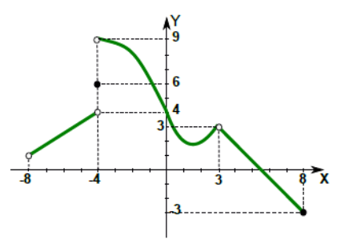

# Ejercicio 1 — Igualdad de funciones y lectura de gráficos

## 1a

{: .enunciado }
> Graficar cada una de las siguientes funciones, indicando el dominio en cada caso. ¿Son iguales?
>
> $$f: D_f\to \mathbb{R}\,/\,f(x)=\dfrac{x^2+x-6}{x-2}\qquad g: D_g\to \mathbb{R}\,/\,g(x)=x+3$$
>
> $$h: D_h\to \mathbb{R}\,/\,h(x)=\begin{cases} \dfrac{x^2+x-6}{x-2} & x\neq 2 \\ -1 & x=2 \end{cases}$$
>
> Luego responder si esta igualdad es verdadera o falsa y justificar, sacando conclusiones:
>
> $$\lim_{x\to 2}f(x)=\lim_{x\to 2}g(x)=\lim_{x\to 2}h(x)$$

{: .resolucion }
> **Simplificación.** Factorizamos el numerador de $f$ y $h$:
>
> $$x^2+x-6=(x-2)(x+3)$$
>
> Para $x\neq 2$ podemos simplificar:
>
> $$\dfrac{(x-2)(x+3)}{x-2}=x+3$$
>
> **Dominios y gráficos.**
>
> - $D_f=\mathbb{R}-\lbrace 2\rbrace$. La gráfica es la recta $y=x+3$ con un **hueco** en el punto $(2,5)$.
> - $D_g=\mathbb{R}$. Es la recta $y=x+3$ completa, incluyendo el punto $(2,5)$.
> - $D_h=\mathbb{R}$. Coincide con $f$ en todos lados salvo en $x=2$, donde se reasignó $h(2)=-1$. Gráficamente: recta $y=x+3$ con el hueco en $(2,5)$ "tapado" por el punto aislado $(2,-1)$.
>
> **¿Son iguales?** **No.** Aunque las tres comparten la misma fórmula reducida $x+3$ para casi todos los valores, difieren en $x=2$:
>
> - $f(2)$ no está definida ($2\notin D_f$).
> - $g(2)=5$.
> - $h(2)=-1$.
>
> Recordando la definición de igualdad de funciones: dos funciones son iguales si y sólo si tienen igual dominio, igual codominio y la misma regla de asignación en todo el dominio. Aquí $D_f\neq D_g=D_h$, y además en $x=2$ los valores de $g$ y $h$ no coinciden.
>
> **Igualdad de los tres límites.** El límite cuando $x\to 2$ depende sólo del comportamiento en un **entorno reducido** de $2$ (no del valor en $2$). En ese entorno las tres funciones valen $x+3$:
>
> $$\lim_{x\to 2}f(x)=\lim_{x\to 2}g(x)=\lim_{x\to 2}h(x)=\lim_{x\to 2}(x+3)=5$$
>
> **Conclusión.** La igualdad de los tres límites **es verdadera**, a pesar de que las funciones no son iguales. Esto ilustra una propiedad fundamental del concepto de límite: **el límite en un punto no depende del valor de la función en ese punto**, sino sólo del comportamiento alrededor.
>
> **Resultado:** las funciones $f$, $g$ y $h$ **no son iguales** (difieren en $x=2$ y en sus dominios), pero los tres límites en $x=2$ coinciden y valen $5$.
>
> **Verificación:** Coincide con la respuesta indicada en la guía.

## 1b

{: .enunciado }
> Determinar el valor de los siguientes límites e imágenes, observando la gráfica de $f$:
>
> 1) $\lim\limits_{x\to -8^+} f(x)$ &nbsp;&nbsp;&nbsp; 5) $\lim\limits_{x\to 8^-} f(x)$
>
> 2) $\lim\limits_{x\to -4} f(x)$ &nbsp;&nbsp;&nbsp; 6) $f(-4)$
>
> 3) $\lim\limits_{x\to 0} f(x)$ &nbsp;&nbsp;&nbsp; 7) $f(0)$
>
> 4) $\lim\limits_{x\to 3} f(x)$ &nbsp;&nbsp;&nbsp; 8) $f(3)$
>
> 

{: .resolucion }
> Sin disponer aquí del gráfico, usamos las respuestas oficiales y explicamos cómo se leen.
>
> | Item | Valor | Cómo leerlo en el gráfico |
> |------|-------|---------------------------|
> | 1) $\lim_{x\to -8^+} f(x)$ | $1$ | Acercándose a $-8$ por la derecha, la curva tiende a altura $1$ |
> | 2) $\lim_{x\to -4} f(x)$ | no existe | Los límites laterales en $-4$ difieren (hay un salto) |
> | 3) $\lim_{x\to 0} f(x)$ | $4$ | Ambas ramas llegan a altura $4$ |
> | 4) $\lim_{x\to 3} f(x)$ | $3$ | Ambas ramas llegan a altura $3$ |
> | 5) $\lim_{x\to 8^-} f(x)$ | $-3$ | Acercándose a $8$ por la izquierda, la curva tiende a altura $-3$ |
> | 6) $f(-4)$ | $6$ | Punto **relleno** marcado en altura $6$ |
> | 7) $f(0)$ | $4$ | Punto relleno en altura $4$ (coincide con el límite → continua ahí) |
> | 8) $f(3)$ | no existe | Hueco abierto (no hay punto relleno) en $x=3$ |
> {: .table-tight }
>
> **Observaciones.**
>
> - En $x=0$ hay **continuidad**: $\lim_{x\to 0}f=f(0)=4$.
> - En $x=3$ existe el límite ($=3$) pero $f(3)$ no está definida: **discontinuidad evitable**.
> - En $x=-4$ el límite no existe (salto finito) y $f(-4)=6$: **discontinuidad esencial de salto**.
>
> **Resultado:** los valores son los listados en la tabla. No existen $\lim_{x\to -4}f$ ni $f(3)$.
>
> **Verificación:** Coincide con la respuesta indicada en la guía.
